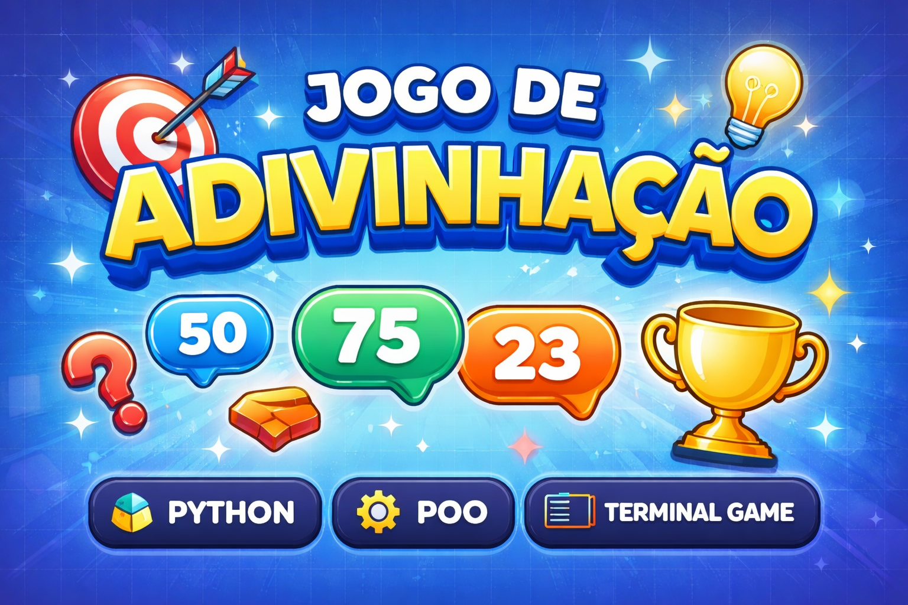
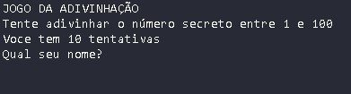
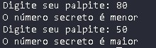
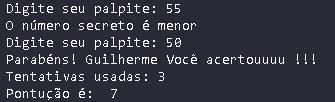

# 🎯 Jogo de Adivinhação em Python

Um jogo simples para adivinhar um número aleatório e praticar **Python** com **Programação Orientada a Objetos (POO)**.

---

## 🧠 Como o jogo funciona

* O sistema gera um número aleatório entre **0 e 100**
* O jogador tenta adivinhar o número
* O jogo informa se o valor é **maior ou menor**
* Existe um **limite de tentativas**
* Ao final, é exibida a **pontuação** e o **número secreto**

---

### Importações

* `random` → gera o número aleatório
* `ABC` e `abstractmethod` → organizam a estrutura do jogo usando POO

### Classe principal

A classe do jogo armazena:

* número secreto
* tentativas
* limite de jogadas
* nome do jogador
* pontuação

Ela funciona como a base de toda a lógica do jogo.

---

## ▶️ Início do jogo

No começo da execução:

* o jogador informa o nome
* o jogo mostra as regras
* o limite de tentativas é exibido

---

## 🎮 Lógica principal

O jogo utiliza um `while` para controlar as tentativas.

A cada rodada:

* o jogador digita um número
* o jogo verifica o palpite
* informa se o número é maior ou menor
* atualiza a pontuação

O jogo termina quando o jogador **acerta** ou **acaba as tentativas**.

---

## 🏁 Final do jogo

Ao finalizar, o programa mostra:

* resultado (vitória ou derrota)
* número secreto
* tentativas usadas
* pontuação final

---

## ⚙️ Execução

Essa parte inicia o jogo e executa toda a lógica criada nas classes.
A estrutura permite adicionar melhorias facilmente sem alterar o código principal.
